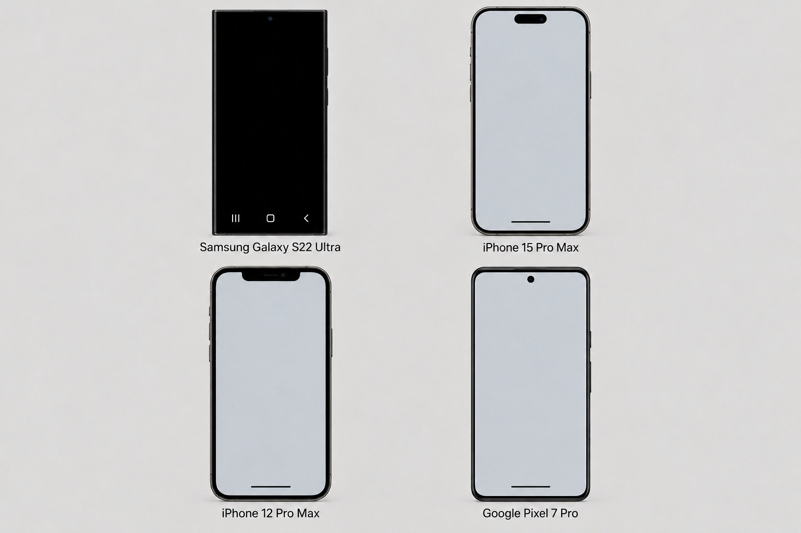
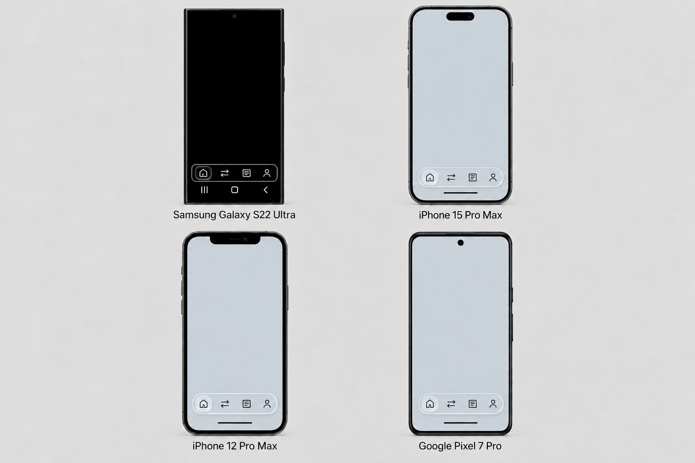
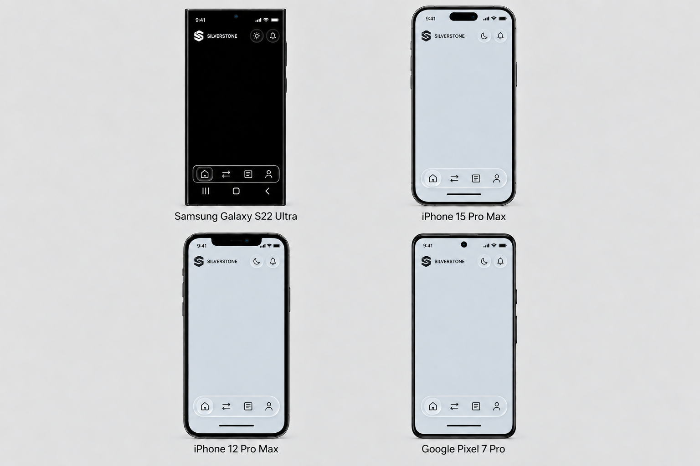
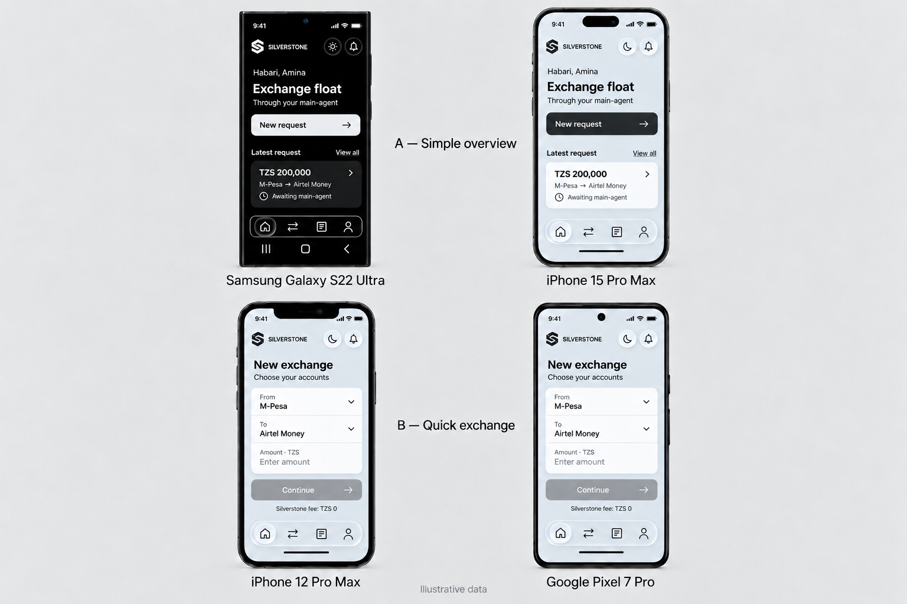
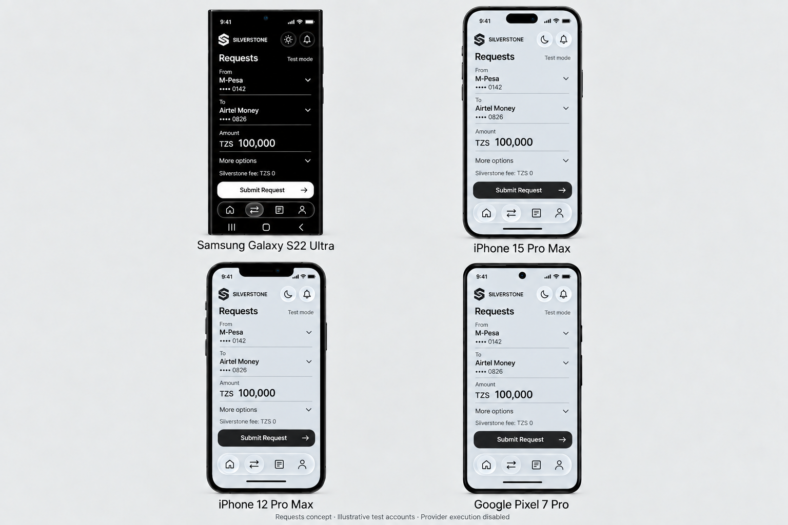
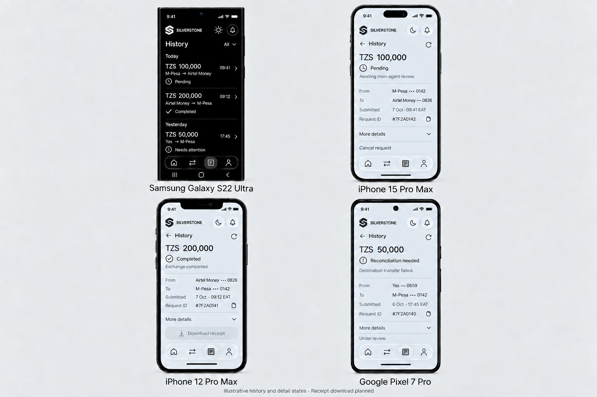
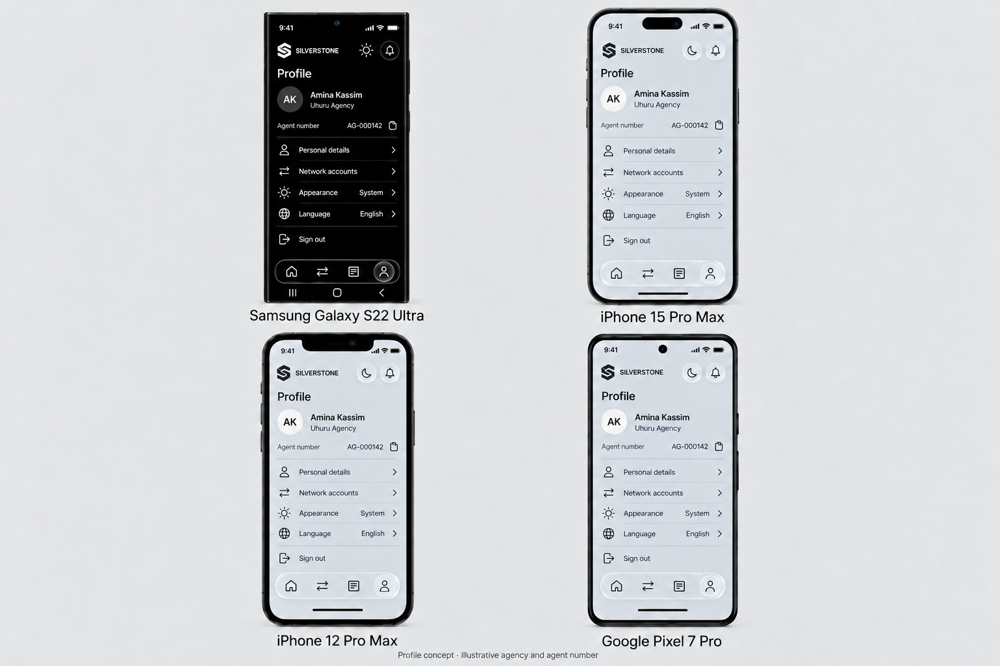

# Silverstone sub-agent UI overhaul — illustrated phase instructions

Prepared: 7 October 2026. Implementation branch: `ui-overhaul`, based on fetched frontend `development` at `64c3c939775085c0bffbd972480e0d75af7c22f5`.

These nine **UI phases** describe the agreed design sequence. The original project roadmap's Phases 7 and 8 remain on hold. UI Phases 7 and 8 below do not resume those roadmap phases.

See [implementation, validation and actual component captures](UI-VALIDATION.md) for the current branch result and remaining native-device checks.

The work covers the first post-login **sub-agent** experience: Home, Requests, History/details and Profile. Implement the visual design faithfully, preserving existing business behaviour. This document and its reference images are a design handoff, not proof of native-device acceptance or authority to execute live payments, issue agent numbers, publish or deploy.

## UI Phase 1 — scope, baseline and design rules

1. Work from the actual Silverstone React Native frontend and preserve the existing authentication, account-status and onboarding gates. The similarly named Next.js event repository is a different project.
2. Use the new `ui-overhaul` branch. Keep the original frontend `development` and backend work separate from this UI change; do not change `main` or production configuration.
3. Use Tanzania throughout: whole-TZS amounts, Tanzanian network names and appropriate English/Swahili. Never carry KES or Kenyan examples into the implementation. Example amounts, names, identifiers and statuses in the figures are illustrative, not records to seed or hard-code.
4. Aim for deliberate, uncluttered typography, breathing room, consistent alignment, modest rounded corners and simple outline icons. Avoid decorative gradients, fake analytics, card grids, nested boxes and densely packed information. The approved navigation glass and Home A's single latest-request surface remain part of the design.
5. Treat Selcom Pesa as the original inspiration and Selcom Huduma as useful agent-workflow context. Borrow clarity and grouping; do not import unsupported wallet balances, bill payments, loans, bank transfers, commissions or settlement capabilities.
6. Keep server state authoritative. Preserve API contracts, route identifiers, validation, account selection, financial command handlers, owner scoping, offline idempotency and permission checks. Do not relabel historical completed volume as available float or balance.
7. Use the app's existing font families and installed visual dependencies. Reach readable contrast and touch-target sizes while matching the reference proportions. Support long names, large text and smaller screens without compressing content into the navigation.

**Reference priority:** device foundation → navigation-only figure → header shell → selected screen composition. Later generated figures can drift; they cannot override the approved shared shell. The drawn phone frames, cutouts and system indicators illustrate safe areas; native OS controls must not be recreated as application controls.

## UI Phase 2 — device foundation and light/dark surfaces

Use the corrected foundation in Figure 1. Preserve the four-device comparison order: Samsung Galaxy S22 Ultra, iPhone 15 Pro Max, iPhone 12 Pro Max and Google Pixel 7 Pro.

- S22 uses the black theme in the reference. The other three use the restrained silver/light theme. In the application, the user's existing appearance preference determines light/dark; do not hard-code a theme by device model.
- Keep each phone's notch, island or punch hole unobstructed. Respect native top and bottom safe-area insets.
- Keep S22's separate Android system-navigation row and the other devices' gesture/home indicators outside the app navigation. The corrected foundation removed the earlier incorrect black footer treatment on the light screens.
- The body should remain an open canvas for content, with no decorative imagery or unverified financial totals.

## UI Phase 3 — glass bottom navigation

Match Figure 2's navigation silhouette and spacing before adding screen content.

- Use a clear rounded rectangular glass bar on the S22 and a neutral capsule glass bar on the other devices. Shape follows the device, independently of the selected light/dark theme.
- Keep a visible gap above native home controls. Slide the selected marker toward the destination icon and slide the page content when changing sections. Respect reduced-motion and reduced-transparency settings and keep effects modest on limited hardware.
- Keep four destinations in order: **Home → Requests → History → Profile**. Use outline icons, a restrained active-state treatment and accessible labels. No emoji icons.
- Keep the bar's position, padding, icon spacing and touch targets consistent across screens. Long content scrolls above it; the keyboard and safe areas must not cover actions.
- Reuse existing route identifiers: `Home`, `NewRequest`, `MyRequests`, and the existing `Profile` destination. Visible labels can say Requests and History without renaming those routes. Preserve existing `Networks` access and retry-prefill routing.
- Profile is a stack destination in the baseline. Making its existing screen reachable through the fourth affordance must not lose drawer-only functions or create a separate account/session flow.

## UI Phase 4 — system status, company header and section label

Use Figure 3 as the common shell for every redesigned sub-agent screen.

- Put the native system status row first: time left, connection/battery indicators right, clear of the camera area.
- Put the application header immediately below the safe area: Silverstone logo/company name left, generous blank space, then theme and notification outline icons right. Keep icon centres aligned and their contrast appropriate to the theme.
- Do not put an avatar, profile or settings control in this top row. Do not add language, QR, fabricated notification counts or decorative controls from the Selcom references.
- Keep profile/settings in the bottom Profile area. Preserve access to the existing appearance, language, Networks and sign-out actions when replacing the original drawer trigger.
- Identify the current area with a compact Home/Requests/History/Profile label. The small section label near the brand is an approved concept; final placement must remain readable and must not shrink or crowd the company header. It must change with navigation.
- Reuse existing theme preferences. The baseline bell has no notification workflow: do not fabricate inbox data or recipients to make the icon appear functional.

## UI Phase 5 — Home, selected Design A

**Use only the upper two phones of Figure 4: A — Simple overview.** The lower B — Quick exchange comparison was not selected as the Home design. Preserve the common shell on all four devices.

The middle content is intentionally short:

1. Compact personal greeting, using the signed-in profile's first name.
2. **Exchange float**, with **Through your main-agent** beneath it. Do not invent an assigned agent's name or a float balance.
3. One obvious **New request** action, using the existing `NewRequest` destination.
4. **Latest request** with **View all**, followed by at most one real preview: TZS amount, source → destination and truthful status. View all opens `MyRequests`; tapping the preview opens that same record's details through History.

Use the latest request overall from the existing descending subscription. This is different from the old `latestCompleted` carousel item. Remove the rotating volume banner, completed-volume chart, duplicated shortcut grid and old page header. Keep older requests and existing functions reachable through History/Profile/Networks rather than presenting extra Home panels.

Preserve the existing owner-filtered request subscription and canonical data. Include loading, true empty and error states; a failed load is not an empty history. Retain the last successfully loaded record with an out-of-date notice after a refresh error, and clear it when the signed-in owner changes. Unknown outcomes must remain visibly unresolved.

**Read-refresh correction:** the baseline Home pull-to-refresh only ran a one-second timer. The UI implementation may use the existing `getDocs` reader with the same owner, ordering and limit as the subscription so refresh/retry reads real data. This changes no endpoint or financial command. Do not turn refresh into payment retry.

## UI Phase 6 — Requests, plain form

Match the latest Figure 5 composition. Keep the common shell fixed and the form as one scrolling screen, using whitespace and thin rules instead of a gradient header or boxed field grid.

1. **From** network/account: preserve the existing supported network selection and corresponding read-only source identifier.
2. **To** network/account: preserve the destination selection and read-only identifier. Source and destination must remain different networks.
3. A prominent **Amount** input with `TZS`, existing whole-TZS validation and comma formatting.
4. **More options**, collapsed by default, exposing the existing `+10k`, `+50k`, `+100k`, `+500k` increment actions and urgency flag. If urgency is set, its enabled state remains visible when the section is collapsed. Urgency flags review; it must not promise priority over the existing queue.
5. **Silverstone fee: TZS 0**, with provider fees remaining unknown unless actual evidence says otherwise. Preserve provider-disabled and synthetic-account disclosures, offline notices, retry-submission controls, errors and result messages in a readable form.
6. One **Submit Request / Tuma Ombi** action. Keep the existing dynamic labels **Saving…**, **Request saved**, and offline **Save on this device**, together with loading/submitted guards.

Preserve account loading/cache ownership, retry-prefill data, quick-add arithmetic, urgent state, `enqueue`, `syncQueue` and idempotent retry. The accepted accounts remain the existing synthetic test fixtures; the UI must not silently permit arbitrary phone/account entry or real funds movement.

There is no new wizard or review step. Do not rename submission into Continue, Send money or Pay. Keep the existing conditional route/amount summary available without restoring a dense boxed layout. The figure's selected networks, masked identifiers and amount are examples.

## UI Phase 7 — History, tapped details and receipt design

Match Figure 6's plain transaction list and detail compositions. The S22 shows the list; the other phones illustrate pending, completed and reconciliation-needed details. These are illustrative states, not proof of real provider execution.

- Show all loaded requests by default, as full-width tappable rows separated by hairlines. Put amount and route first, with a smaller time/status line. Retain existing filters, loading/error/retry states, refresh and urgency semantics without restoring a card grid.
- Tapping a row opens that same record. Show its amount, canonical status, route, masked account identifiers, submitted time, request ID and permitted actions. Refresh remains a read of the selected request; copying a displayed short ID must copy the actual full identifier.
- Keep the initial detail view short. Additional fee, provider, reservation, leg and audit information can be placed behind a clear More details disclosure, with important unresolved-state warnings still visible.
- Preserve exact state meaning: Awaiting review; Reserved/provider disabled; Reconciliation needed; Completed; Rejected; Cancelled; Expired. A failed payment leg/evidence is not interchangeable with the whole request being rejected or completed. Unknown results remain unresolved and must not invite another payment.
- Retain cancel only where existing permissions allow it and the existing prepare-new-request/retry-prefill action for rejected requests. Do not add payout, refund, hold-release or automatic retry actions.
- Missing provider references are **Not recorded** or unavailable, not generated identifiers. Silverstone's zero fee is distinct from unknown provider charges. If a timestamp is converted from the stored UTC value for local display, identify EAT correctly; do not silently change the actual recorded time.

**Receipt download is future integration.** The active detail screen currently copies the request ID and has no downloadable receipt. The faded Download receipt affordance in the figure is a proposal. Implementing it later must use recorded transaction data and clearly represent the actual status; a request record is not proof of settlement. The old unused RequestCard component's clipboard receipt is not a PDF/download implementation.

## UI Phase 8 — Profile and identity

Match Figure 7's minimal identity block followed by plain settings rows.

- Show the personal name prominently, agency/business name beneath it, and agent number as a compact read-only line. Keep illustration names and numbers out of production data.
- The existing API supplies UUID identity, name, email, phone, role and account/application states. Business name exists in application data; displaying it requires an explicit read of the available application data, rather than assuming `/me` already returns it.
- The illustrated `AG-000142` is a sample only. No public agent-number field or assignment policy currently exists. Agent-number assignment and the final format are future backend work; do not derive an issued number from a truncated UUID or permit self-assignment.
- Keep Personal details, Network accounts, Appearance, Language and Sign out reachable. Reuse working Networks routing, existing light/dark/system preferences, English/Swahili controls and the existing sign-out confirmation.
- Name editing is supported by the baseline API. Its existing phone/location edit controls are not backed by that API, and Change PIN/Help/Terms callbacks are placeholders. Do not depict those gaps as already implemented or silently add new endpoints in this UI branch.
- Use generous spacing, subtle separators and simple icons. Do not add account totals, achievements, commission figures or a card grid. Keep the shared top header free of profile/settings controls.

## UI Phase 9 — integration, fidelity checks and deferred work

The visual implementation must retain the actual app interactions and states, rather than becoming a static or shallow approximation of these screens.

1. Compare each implemented screen against the selected figure and shared shell: typography, spacing, borders, surfaces, alignment, navigation position, active states and light/dark contrast. Resolve reference drift in favour of Figures 1–3. Preserve the approved S22 sun/light-theme affordance rather than copying an accidental later moon icon.
2. Verify existing NewRequest validation/submission/offline behaviour, account ownership, latest-record selection, History filters/details/refresh/cancel/retry, Profile routing, appearance/language and sign-out. Exercise loading, zero records, long names, large amounts, failed reads, stale records, offline saves and unknown outcomes.
3. Run the existing frontend regression checks and Android JS/Hermes export, plus focused handler checks for changed UI navigation/read behaviour. An export does not prove native-device visual acceptance. Review keyboard avoidance, screen-reader labels/focus, touch targets, large text and safe areas on the target device sizes when devices/emulators are available.
4. Keep code changes scoped to sub-agent presentation and its shared shell. Preserve `AuthContext`, API/client contracts, request validators, provider boundaries, backend migrations and financial handlers. Any read-only UI data-refresh/navigation correction must be recorded explicitly.
5. Maintain a deferred register for public agent-number issuance, downloadable receipts, unimplemented settings actions, authentic provider settlement/reconciliation and final native acceptance. These are not completed merely because a figure contains an affordance.
6. Keep the original project Phases 7 and 8 on hold. Do not start pilot activation, provider cutover, live grants, messages, financial resolution or production policy configuration as part of this visual redesign.

## Image inventory and interpretation

The seven PNGs under `design/` are byte-for-byte copies of the generated stage references, not newly generated designs or altered source images. Figure 4 intentionally includes the comparison: **A is selected; B is not**. Figure 6 contains a proposed receipt action; Figure 7 contains an illustrative agency/agent number. None of the examples establishes real account ownership, issued identity or verified payment execution.

Earlier KES finance concepts, brushed-card/keyboard concepts, the initial foundation footer, the first A/B layout, the denser Requests form and the first History icon treatment were superseded. They must not override this selected sequence. Selcom reference photos supplied in the conversation inform the header arrangement but do not authorise copying their extra controls or unsupported product features.
