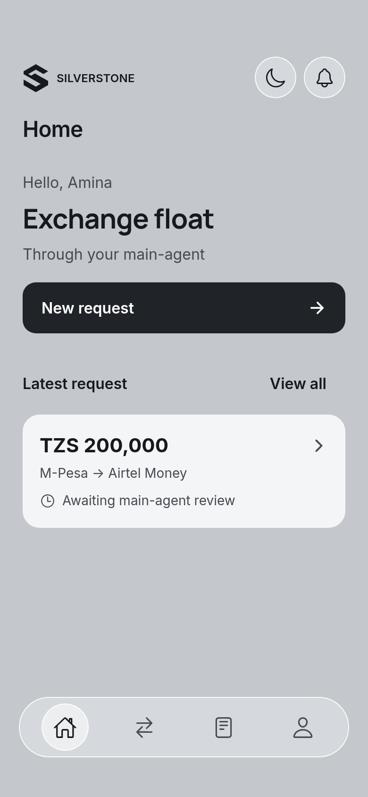
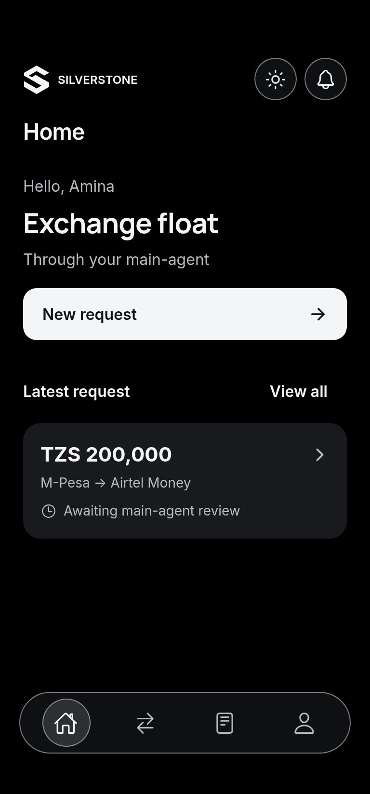
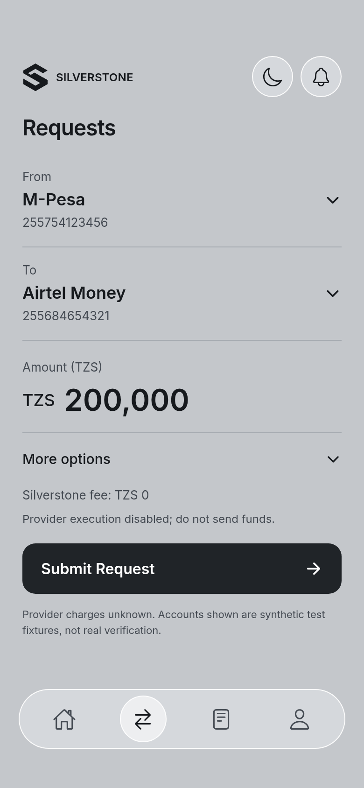
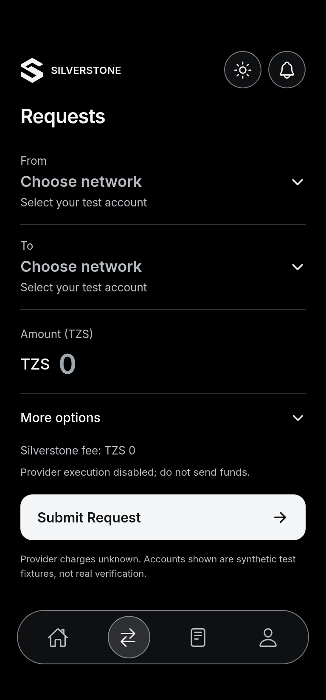
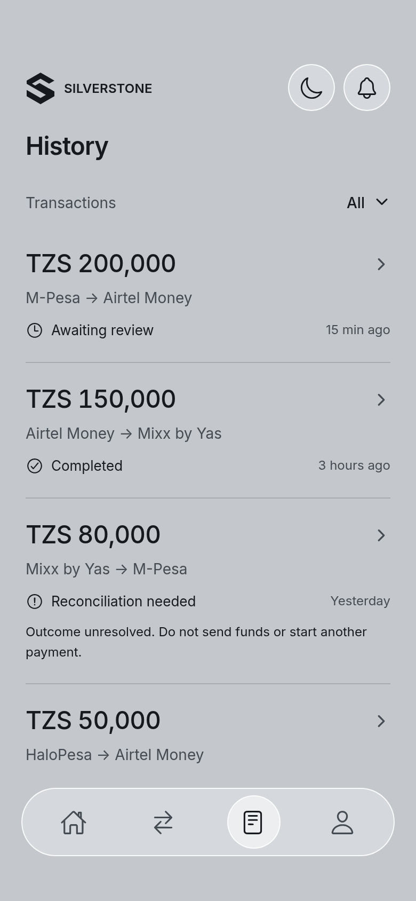
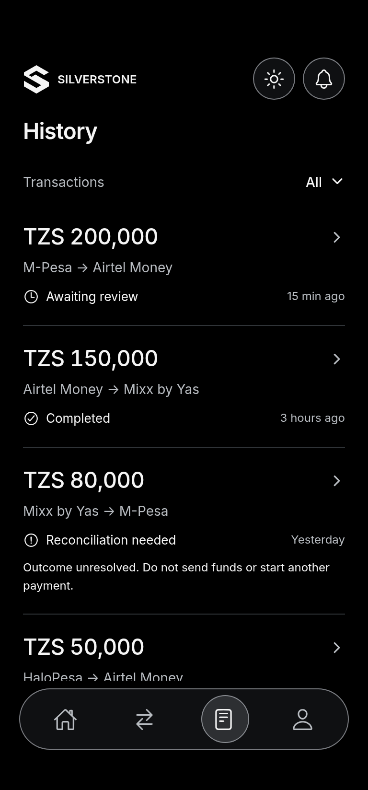
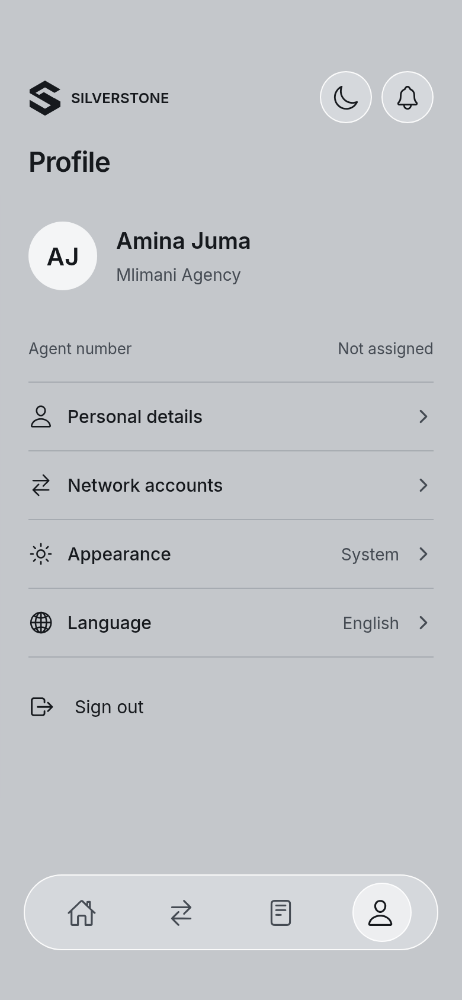
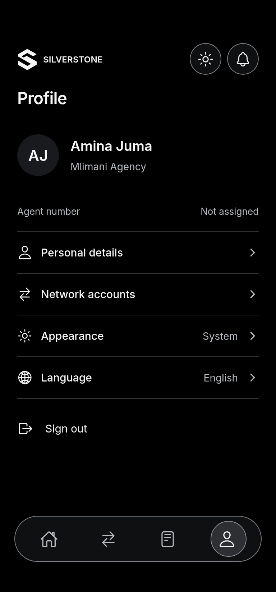

# UI overhaul — implementation and validation

Validated 7 October 2026 on `ui-overhaul`, based on frontend `development` commit `64c3c939775085c0bffbd972480e0d75af7c22f5`. The [illustrated phase instructions](UI-OVERHAUL.md) contain the seven design references and identify selected versus superseded concepts.

## Implemented

The assigned-agent experience now has four persistent destinations: **Home → Requests → History → Profile**. The shared header, animated section title and floating navigation remain in place while pages slide. Visited pages retain their state. Requests mounts only after its first actual selection, so a cancelled swipe cannot start its existing offline synchronisation.

The scoped palette uses silver/light surfaces and true-black dark surfaces, with system appearance or a saved user override. Navigation uses a rounded rectangle on the S22 Ultra and a capsule elsewhere, independently of theme. Native system controls are not drawn by the app. iOS uses restrained blur; Android and reduced-transparency settings use a lightweight neutral surface.

- Home shows a greeting, one new-request action and the latest real request.
- Requests keeps the existing account selections, whole-TZS input, optional increments/urgency, fee and provider disclosures, submission guards and offline queue.
- History uses plain rows, existing filters and readable request details. Critical reconciliation warnings remain visible; secondary audit information expands on demand.
- Profile provides identity, existing name editing, network accounts, appearance, language and sign-out. Unsupported identity fields remain explicitly unavailable.

## Preserved boundaries and intentional UI corrections

There are no changes to the backend, authentication context, API/configuration/hooks, main-agent screens/navigation, shared financial detail modal or global colour constants. The request account-selection, amount formatting/change, quick-add, validation and submission functions were compared with the baseline using parsed syntax trees and are unchanged.

The following presentation/navigation corrections are intentional:

1. Home now shows the latest request overall. Pull-to-refresh performs the existing owner-scoped read instead of the baseline's cosmetic timer.
2. Explicit rejected-request prefill is consumed when Requests is already mounted; normal tab changes preserve a draft and its route parameters.
3. Home and History ignore stale responses after a signed-in owner changes. Selected detail refreshes cannot overwrite another selected record.
4. A saved English preference restores English; the baseline restored Swahili for either saved language.
5. Unsupported phone/location editing and inert settings entries are not presented as working actions. Name editing and network-account saving use their existing paths.

Added native/UI dependencies are Expo-compatible `expo-navigation-bar`, `react-native-pager-view` 6.3.0 and `react-native-tab-view` 3.5.2. Existing dependency versions were retained. A previously installed development client may need rebuilding for the added native modules.

## Checks completed

| Check | Result |
| --- | --- |
| Existing regression suite plus six presentation tests | **32 passed**, including account masking, honest missing values, provider labels, EAT conversion/fallback, normal-text contrast and S22 shape detection |
| Android and iOS Expo/Hermes exports | **Both passed** |
| Lockfile clean-install dry run | **Passed** |
| Patch whitespace validation | **Passed** |
| Real-component browser journeys with synthetic transport | **Passed**; no uncaught runtime errors |
| Light, dark and compact layout review | **Passed** in the isolated browser harness |

Repository checks can be repeated from the frontend root:

```sh
node --test --test-isolation=none tests/*.test.mjs
npm ci --ignore-scripts --dry-run --no-audit --no-fund
CI=1 EXPO_OFFLINE=1 npx expo export --platform android --platform ios --output-dir /tmp/silverstone-ui-export --max-workers 2
git diff --check
```

The session's browser harness lived outside the repository and used the actual React Native navigation, screens, data adapter, offline hook and persisted outbox through React Native Web. Only authentication fixtures, API transport, connectivity, the global loader and Expo application constants were substituted. Every name, account and request in these captures is synthetic; no production transaction was used. Browser network access was limited to its local server. Test-only authentication bypasses, browser tooling and fixtures are not shipped with the application.

The runtime journeys covered:

- Four-tab taps and swipes, persistent drafts, latest-record and View all navigation, and nested Profile/Networks return navigation.
- Source/destination selection, amount increments, urgency, submission guards and one submission with the existing owner/idempotency payload.
- Offline save with zero POSTs, then reconnect with the same persisted key submitted once; a cancelled first swipe performs no account load or outbox POST.
- Rejected-request prefill after Requests has already mounted; subsequent ordinary tab changes retain that draft.
- History filters, pending/completed/unresolved details, permitted cancellation, More details, and inactive future receipt download.
- Name saving, theme override persistence, System appearance changes, language persistence, loading/empty/error states and scrolling at 320 × 568.

## Actual component captures

These are **browser renders of the implemented React Native components**, not native-device screenshots or new design mockups. The light viewport is 390 × 844 and the dark viewport 384 × 824. Safe areas are synthetic; device frames, native status icons, camera cutouts, home indicators and system buttons are omitted. The generic browser model uses the capsule bar in both themes; S22 shape selection is implemented and separately unit-tested.

| Screen | Light | Dark |
| --- | --- | --- |
| Home |  |  |
| Requests |  |  |
| History |  |  |
| Profile |  |  |

Additional captures: [completed-request details](implementation/history-completed-light.png) and [network accounts](implementation/network-accounts-light.png).

## Limits and deferred work

Native exports verify bundling, not native-device acceptance. The S22 Ultra, Pixel 7 Pro, iPhone 12 Pro Max and iPhone 15 Pro Max still need checks for physical safe areas/system controls, keyboard avoidance, blur, screen-reader announcements, large text and animation performance. The browser pager also develops an input-focus horizontal scroll offset that the native PagerView does not use; final captures blurred the input and cleared that browser-only offset. No production workaround was added for the harness. React Native Web's legacy selected-tab accessibility mapping cannot verify native announcements.

Receipt downloads, public agent-number issuance, agency-data integration and push notifications remain deferred. Missing values are not generated from sample designs. No new financial execution, refund, reconciliation-resolution or provider activation capability was added. The original roadmap's Phases 7 and 8 remain on hold.

## Loader follow-up — 7 October 2026

Removed the rotating S from both shared entry points: the startup/auth-resolution screen and the global action overlay. They now share three small monochrome dots with a localized Loading… / Inapakia… label. Dots gently change opacity, stay still under reduced-motion settings, and use the silver/black palette. The overlay uses a matte scrim instead of the previous heavy blur and embedded WebView. The obsolete HTML/base64 spinner was deleted.

This requested global change also reaches authentication, onboarding and main-agent actions that already use the same loader. Existing show/hide callbacks, fade durations, calling screens, authentication and financial handlers are unchanged. Static brand logos remain branding. The 32 regression tests and Android/iOS exports passed again after this change.

An isolated browser check of the actual `ScreenLoader` and `LoaderProvider` also passed: light/dark appearance, English/Swahili labels, overlay show/hide, live language changes, and reduced-motion updates. With reduced motion enabled, all three dots stayed at a fixed opacity; disabling it restored the pulses. No logo, embedded WebView or uncaught runtime error remained in either loader.
